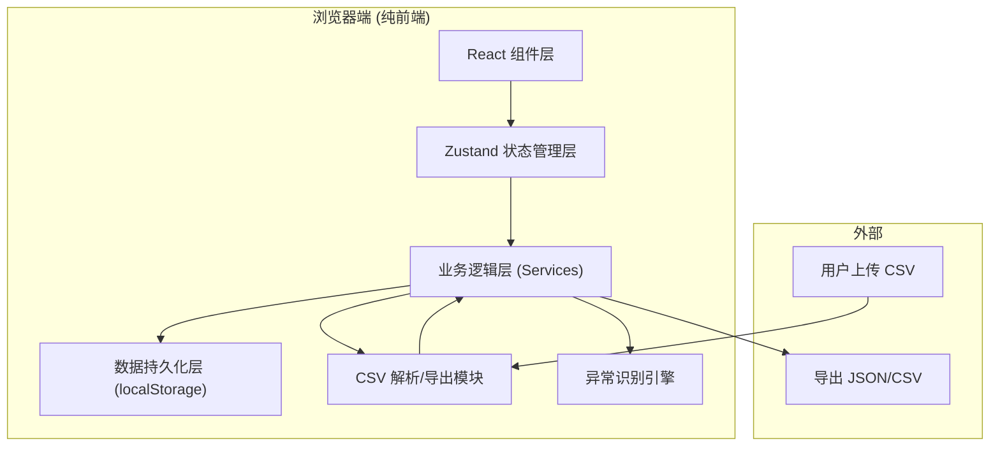

## 1. 架构设计



## 2. 技术描述

- **前端**：React@18 + TypeScript + tailwindcss@3 + Vite
- **初始化工具**：vite-init (react-ts 模板)
- **后端**：无（纯前端，数据存储于 localStorage）
- **数据库**：浏览器 localStorage（通过 zustand-persist 中间件自动持久化）
- **状态管理**：Zustand
- **CSV 解析**：papaparse
- **日期处理**：date-fns
- **图标**：lucide-react

## 3. 路由定义

| 路由 | 用途 |
|------|------|
| / | 看板主页（唯一页面，单页应用） |

## 4. 数据模型

### 4.1 数据模型定义

```mermaid
erDiagram
    ARRIVAL_BATCH {
        string batchId PK "批次号"
        string productName "产品名称"
        string arrivalTime "到货时间 ISO"
        number requiredTempMin "要求温度下限"
        number requiredTempMax "要求温度上限"
        string supplier "供应商"
        number quantity "数量"
        number sourceRow "原始CSV行号"
        string sourceFile "来源文件名"
    }
    TEMPERATURE_LOG {
        string id PK
        string batchId FK "批次号"
        string timestamp "记录时间 ISO"
        number temperature "温度值"
        string rawValue "原始值(用于异常展示)"
        number sourceRow "原始CSV行号"
        string sourceFile "来源文件名"
        boolean isValid "记录是否有效"
        string invalidReason "无效原因"
    }
    MANUAL_REVIEW {
        string id PK
        string batchId FK "批次号"
        string reviewer "复核人"
        string conclusion "放行/隔离/忽略"
        string remark "备注"
        string reviewTime "复核时间 ISO"
        number sourceRow "原始CSV行号"
        string sourceFile "来源文件名"
    }
    ANOMALY {
        string id PK
        string batchId FK "批次号"
        string type "超温/缺日志/到货未登记/复核冲突"
        string severity "warning/danger"
        string description "异常描述"
        json detail "异常详情(超温区间列表/缺失时间段/冲突对比)"
        number[] sourceRows "关联原始行号"
    }
    REVIEW_DECISION {
        string batchId PK
        string conclusion "放行/隔离/忽略/未复核"
        string reviewer "复核人"
        string remark "备注"
        string updatedAt "更新时间 ISO"
    }
    IMPORT_RECORD {
        string id PK
        string fileType "arrival/log/review"
        string fileName "文件名"
        number totalRows "总行数"
        number validRows "有效行数"
        number invalidRows "无效行数"
        string importedAt "导入时间 ISO"
        json invalidDetails "无效行详情"
    }
```



### 4.2 Zustand Store 结构

```typescript
interface AppState {
  // 业务数据
  arrivalBatches: ArrivalBatch[];
  temperatureLogs: TemperatureLog[];
  manualReviews: ManualReview[];
  anomalies: Anomaly[];
  reviewDecisions: Record<string, ReviewDecision>;
  importRecords: ImportRecord[];

  // UI 状态
  currentReviewer: string;
  filters: {
    batchId: string;
    anomalyTypes: string[];
    reviewStatuses: string[];
  };
  selectedBatchId: string | null;

  // Actions
  importArrivals: (file: File) => Promise<ImportResult>;
  importTemperatureLogs: (file: File) => Promise<ImportResult>;
  importManualReviews: (file: File) => Promise<ImportResult>;
  loadSampleData: () => void;
  detectAnomalies: () => void;
  setReviewDecision: (batchId: string, decision: ReviewDecisionInput) => void;
  setFilters: (filters: Partial<FilterState>) => void;
  exportData: (format: 'json' | 'csv') => void;
  clearAll: () => void;
}
```

## 5. 核心模块设计

### 5.1 CSV 导入模块

- **必填列校验**：
  - 到货清单：batchId, productName, arrivalTime, requiredTempMin, requiredTempMax
  - 温度日志：batchId, timestamp, temperature
  - 人工复核：batchId, reviewer, conclusion
- **错误处理**：
  - 坏时间戳：标记 invalid，记录 invalidReason='时间格式错误'
  - 非数字温度：标记 invalid，记录原始值和 invalidReason='温度非数字'
  - 缺必填列：拒绝整文件导入，返回缺失列名
  - 重复导入：基于 (fileType, fileName, fileHash) 去重，已导入则跳过或增量合并（不清除已有有效数据）
- **行级追踪**：每条记录保存 sourceRow 和 sourceFile

### 5.2 异常识别引擎

1. **超温区间**：按批次排序温度日志，滑动窗口识别连续超温段，输出 [{startTime, endTime, maxTemp, minTemp, durationMin}]
2. **缺日志**：到货时间范围内（arrivalTime ± 2h 缓冲）无有效温度记录，或相邻记录间隔 > 30 分钟
3. **到货未登记**：温度日志 / 人工复核中存在某批次号，但到货清单中不存在
4. **复核冲突**：同一批次在 MANUAL_REVIEW 表中存在多个不同结论，或导入的复核结论与系统已有 ReviewDecision 不一致

### 5.3 持久化一致性

- zustand persist 中间件，存储 key=`cold-chain-dashboard-v1`
- 重启后保留：所有业务数据、复核决策（复核人/备注/更新时间）、筛选条件、当前复核人
- 导入新数据时：按主键 (batchId) 合并，不覆盖已有的 reviewDecision

### 5.4 导出一致性

- 导出数据 = 应用当前 filters 后的 anomalies 列表 + 关联批次信息 + 复核决策
- JSON 导出：完整结构
- CSV 导出：扁平化一行一异常，列包含批次号、产品、异常类型、异常描述、复核结论、复核人、备注、更新时间
