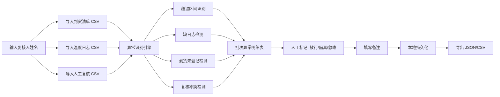

## 1. 产品概述

本地冷链到货温控复核看板，面向冷链物流质控人员，用于导入到货清单、运输温度日志和人工复核数据，自动识别温控异常并支持人工复核决策（放行/隔离/忽略），所有数据本地持久化，不依赖外部仓储系统。

- 目标用户：冷链物流质控专员、仓库收货主管
- 核心价值：快速定位温控异常批次，规范复核流程，保留可追溯审计轨迹

## 2. 核心功能

### 2.1 用户角色

| 角色 | 注册方式 | 核心权限 |
|------|----------|----------|
| 质控人员 | 本地录入姓名 | 导入数据、查看异常、标记复核结论、导出明细 |

### 2.2 功能模块

1. **数据导入区**：到货清单 CSV 导入、运输温度日志 CSV 导入、人工复核 CSV 导入、样例数据一键加载
2. **汇总指标区**：总批次数、超温批次数、缺日志批次数、到货未登记批次数、复核冲突批次数、已复核批次数
3. **批次筛选区**：按批次号搜索、按异常类型筛选、按复核状态筛选
4. **异常明细表**：批次维度的异常列表，展示异常类型、详情、原始行定位、复核操作
5. **异常详情面板**：超温区间时间线、温度日志缺失段、复核冲突对比
6. **导出功能**：按当前筛选结果导出 JSON / CSV
7. **异常复现文档**：内置至少三类异常的复现步骤说明

### 2.3 页面详情

| 页面名称 | 模块名称 | 功能描述 |
|----------|----------|----------|
| 看板主页 | 数据导入区 | 三个独立 CSV 导入按钮，支持拖拽，显示导入进度和错误行统计 |
| 看板主页 | 汇总指标卡片 | 6 个指标卡片，点击可跳转到对应筛选结果 |
| 看板主页 | 筛选工具栏 | 批次号搜索框、异常类型多选、复核状态多选、重置按钮 |
| 看板主页 | 批次异常明细表 | 可展开行，展示异常详情、温度日志片段、原始 CSV 行号定位 |
| 看板主页 | 复核操作列 | 放行 / 隔离 / 忽略 三个按钮，复核人自动记录，可填写备注 |
| 看板主页 | 导出工具栏 | 导出 JSON、导出 CSV，与当前筛选结果一致 |
| 看板主页 | 异常复现文档抽屉 | 点击右上角"帮助"打开，展示异常复现步骤 |

## 3. 核心流程

质控人员登录（输入姓名）→ 导入三类 CSV 数据 → 系统自动识别异常 → 在明细表中逐批次查看异常详情 → 人工标记放行/隔离/忽略并填写备注 → 按筛选结果导出明细报告。

## 4. 用户界面设计

### 4.1 设计风格

- **主色调**：深冷蓝 `#0F172A`（代表冷链与专业），辅以冰蓝 `#38BDF8` 作为主操作色
- **强调色**：预警橙 `#F59E0B`、危险红 `#EF4444`、成功绿 `#10B981`、中性灰 `#64748B`
- **背景**：深色模式为主，渐变暗蓝背景，配合微弱网格纹理营造工业感
- **按钮风格**：方形微圆角（4px），扁平化设计，hover 时有细微的发光边框效果
- **字体**：标题使用 `Space Grotesk` 等宽工业风字体，正文使用 `Inter` 保证可读性
- **布局**：顶部固定导航栏 + 左侧导入区 + 右侧主内容区（指标卡 + 表格），采用经典数据看板布局
- **图标风格**：Lucide 线性图标，统一 18px 尺寸

### 4.2 页面设计概览

| 页面名称 | 模块名称 | UI 元素 |
|----------|----------|---------|
| 看板主页 | 顶部导航 | 深色渐变背景，产品标题，复核人姓名显示，帮助按钮 |
| 看板主页 | 数据导入卡 | 三张并排卡片，每张含文件选择区、文件名称显示、导入状态、错误提示 |
| 看板主页 | 汇总指标行 | 6 个带图标的统计卡，数字大号字体，底部点击跳转提示 |
| 看板主页 | 筛选工具栏 | 搜索框 + 多选标签组，紧凑排列，阴影分层 |
| 看板主页 | 异常明细表 | 斑马纹行，可展开二级面板，异常标签彩色圆角 |
| 看板主页 | 复核操作区 | 三按钮组（绿/红/灰），弹出备注输入模态框 |
| 看板主页 | 异常详情抽屉 | 右侧滑出，展示温度时间线、日志对比、原始行 |

### 4.3 响应式

- 桌面优先（≥1280px），三栏布局
- 平板（768-1279px）：导入区折叠为顶部横排
- 移动端（<768px）：单列堆叠，表格横向滚动

### 4.4 交互动效

- 页面加载：指标卡片数字从 0 滚动到实际值
- 异常标签：hover 时轻微上浮 + 阴影加深
- 展开行：高度过渡动画（200ms ease）
- 导入成功：绿色勾选图标脉冲动画
- 复核操作：按钮点击后状态色扩散填充
